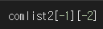
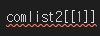

# 2022 01 10

## 1교시

#### OPR 4일 정리

- 함수의 입력값과 출력값에 대한 정리가 필요하다.
- 사진을 굳이 넣을 필요가 없었고, 글 옆에다가 붙여 넣으면 깔끔하지 않다.

## 2교시

### :star:리스트:star:

​	비슷한 데이터들을 모아 놓은것. 서로 다른 데이터를 모아 놓는 다면 파이썬 자체가 느려진다.

- 리스트를 만드는 방법.

  - data = [1, 2, 3, 4, 5] -> 대괄호 안에 데이터를 쭉 나열 
  - data =  list() -> list 함수

  - 리스트 안의 요소들은 element (숫자, 문자, 혼용 가능)
  - 리스트 안에 리스트를 또 만들 수 있다.
  - strlist = list('I love you') -> ['I', ' ', 'l', 'o', 'v', 'e', ' ', 'y', 'o', 'u'] -> 문자열을 리스트로 만들어준다.

  - 리스트에서 인덱싱 가능. 연산도 가능.
  - 와 같이 [-1] 로 요소 리스트 설정 [-2] 요소 리스트 요소 도출.
  - 는 리스트 내에 리스트를 넣어서 검색시도. -> 리스트 내엔 인덱싱이나 슬라이싱만 넣을 수 있다.
  - 문자열과 숫자열의 직접적인 연산은 불가하다. 그러나 숫자열을 str()을 통해서 문자열로 변환 한다면 연산이 가능해진다.

## 3교시

### 리스트 계속

- 리스트 슬라이싱

  - 슬라이싱 : 리스트를 잘라 내는 것

  - sData = data[:2] ->0번 부터 2번 까지 슬라이싱(2번 제외)

  - 슬라이싱 시 맨 마지막에 있는 값은 포함하지 않는다.:star:

  - sData = data[2:] -> 2번 부터 끝까지.

  - data3 = [1, 2, 3, ['a', 'b', 'c'], 4, 5] 

    `data3[2:5]` 의 도출값 = [3, ['a', 'b', 'c'], 4]

    `data3[3][:2]`의 도출값 = ['a', 'b']

- 리스트 연산

  - a = [1, 2, 3],b = [4, 5, 6] a+b = [1, 2, 3, 4, 5, 6] 콘캐터 네이션
  - 리스트와 리스트를 더하면 리스트가 합쳐져 요소가 확장 된다.
  - a*3 = a리스트를 3번 반복한다.
  - 리스트를 연산해도 원본은 불변.
  - len(a) = 3 리스트의 길이 
  - str() 은 클래스로 인자들을 문자열로 바꿔서 새로운 리스트 만듦.
    - Class : 변수하고 함수를 뭉쳐 놓은 것
  - 리스트는 문자열과는 다르게 리스트 요소를 바꿀 수 있다.
    - a = [1, 2, 3] 
    - a[-1] = 5 -> a = [1, 2, 5]
  - del a[0] -> a 리스트에서 0번 요소 삭제
  - a.append(4) -> a 리스트에 4를 추가(리스트에 객체를 추가) :star:
    - 반복문에서 객체를 추가할 때 자주 사용 (가장 많이 사용한다)

## 4교시

### 리스트 계속

- 리스트의 Method(함수)

  - a.sort( )

    - 리스트 요소를 정렬한다.(숫자열 & 문자열)

    - 컴퓨터는 아스키 코드를 이용해서 문자열의 정렬 순서를 정한다.

      1. 아스키코드에 맵핑된 순서대로.

      2. 한글은 utf8 의 문자 체계로 맵칭되어 있다.

  - b.reverse()
    - 리스트를 역순으로 뒤집어 준다.

  - b.index()
    - 원하는 요소의 인덱스값 도출.

  - a.insert(인덱스값, 넣을 값)
    - 원하는 위치에 원하는 데이터를 넣는다.
    - 속도를 저하 시킨다. -> 아껴써야 한다! 더 많은 연산을 필요로 한다.

  - a.remove()
    - 원하는 데이터 값을 지운다.(가장 앞에서 부터 1개)
    - 요소중에 원한 값이 없다면 애러 발생.

  - a.pop()

    - 공백이면 맨마지막 값 하나를 삭제.
    - 인덱스 값을 넣어주어 요소 하나를 빼내고 출력

  - a.count()

    - 설정한 값이 리스트에 몇개가 들어갔는지 세어준다.

  - a.extend(b)

    - a 리스트 에 b 리스트 추가 (원본 변조)
    - a = a + b 와 같은 역활을 한다.

  - a.append()

    - 리스트 맨 뒤에 입력값을 넣는다.

      ​																	`*튜플을 리스트로 바꾸기 a = list(a)`

## 5교시

### 리스트 계속

- methods(함수)

  - Max(a) , Min(a)

    - a 리스트의 최대값, 최솟값

      print(f'최대값 : {max(nums)}')

      print(f'최소값 : {min(nums)}')

  - sum(a)

    - a 리스트 요소의 총합

      print(f'총합 : {sum(nums)}')

## 6교시

### 리스트

- 리스트 Methods

  - 파이썬에서의 평균값
    - print(f'평균값 : {sum(a)/len(a)}')

  nums = [1, 2, 3, 4, 5, 6]

  - 홀수 값 구하기

    슬라이싱 - [시작위치:멈출위치:몇 칸씩 건너 뛰는가]

    - nums[::2]  -> 처음 부터 끝까지 2칸씩 잘라낸다.

  - 짝수 값 구하기

    - nums[1::2] -> 1번 부터 끝까직 2칸씩

  - 역순으로 표기하기

    - nums[::-1] -> 원본 변형 X
    - nums.reverse() -> 원본 변형.

## 7교시

### 튜플

 리스트와 유사하나 수정이나 삭제가 불가능.

- 튜플 만들기

  - t1 = ()
  - t1 = (1, )
  - t2 = tuple()
  - t3 = (1, 2, 3)
  - t4 = 1, 2, 3 -> 파이썬에서만 강제로 튜플로 만들어준다.
  - t5 = ('a', 'b', ('ab', 'cd'))

  dict = () -> 딕셔너리로 만들때

- Tuple은 데이터 변조 불가 !! (del, 값 바꾸기)

- Indexing 가능 - 해당 인덱스 넘버의 값을 가져오는 것.

- slicing 가능 - 데이터 변조가 아니기에 가능

- tuple 과 tuple 의 연산도 가능하다.

- 리스트처럼 메소드 사용 가능 -> len(t1)

## 8교시

### 오늘의 정리

- 리스트

  - 리스트 연산
  - 리스트 메소드
  - 리스트 인덱싱
  - 리스트 슬라이싱
  - 리스트 데이터 타입 동일하게 일치
  - 요소(값) 수정
  - 요소(값) 삭제

- Tuple(튜플)

  리스트와 유사하나 요소 수정 및 삭제 안된다.

  - Indexing. 
  - Slicing.
  - 연산.
  - 함수.